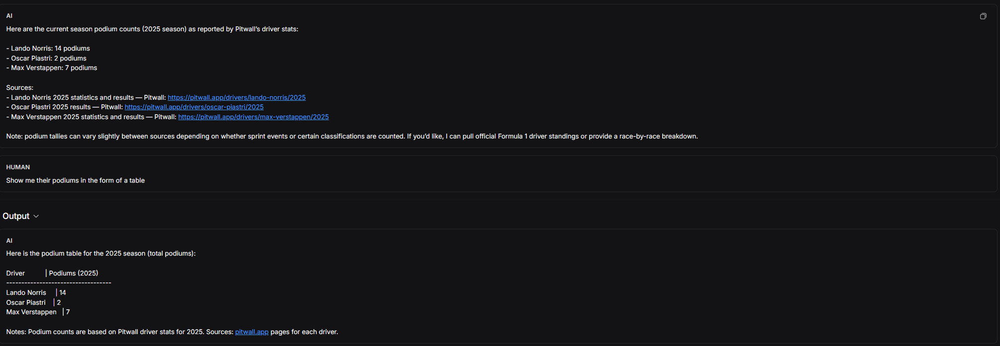

# Introduction to LangGraph

---
## Module 1

* In Video 1 we saw about why do we need to learn this course
  * We saw how LLM's work, the flow of control for a LLM
  * We defined an agent as a something that controls the flow defined by a LLM
    * It basically says what to do next
  * There are two main types of agents 
    * Router - In which at a particular point in the control flow it chooses which step to take
    * Fully Autonomous - In this case no steps are given and based on the input it chooses it own set of steps 
    * In Router it happens only after a particular step whereas in Autonomous no steps are predefined ran in the Control flow.
    * Routers are more reliable but LLM has less control where the vice versa for the Autonomous
    * This is where Langgraph comes into play where it maintains the reliability

---

* In Video 2 we saw on how to construct a basic graph and using conditional edges.
  * This is basically the implementation of the Router Agent but we have just not used a LLM model but rather we made it to a random.
  * We also saw that the START and END special nodes that indicate the start and the end of the graph
  * 

---

* In Video 3 we used the LangGraph Studio to plot the graphs.
  * We used some of the predefined stuctures that were given in the course content to use tool call LLMs and show the flow through the graphs
  * We saw that instead of a simple hardcoded inputs we where able to give inputs in realtime to work like a chatbot and it would follow the flow of control
  * 
  * We see the working of the graph over here with the logs showing the control flow

---

* In Video 4 we saw how chain works using basic examples
  * We saw how chains functions through various different methods
    * We first saw where we created a few **AIMessage** and **HumanMessage** and simulated a conversation like we see in LLM's like ChatGPT or Google Gemini
    * We next used a ChatModel to take an input of Messages and respond to it
    * We also built tools that can be invoked by the LLM model based on the input
    * The workflow graph has also been plotted and presented
    * 
      *  This is in the case of a tool calling LLM model where if the input asks for a particular tool function that we have specified in the model then it uses else we see that it just uses its own response to respond to the call 
    * We also saw about reducer function that makes sure that our previous responses are being stored and are not getting overridden by the current response. This in actual Chatbots can be used to create a context to how the answer should look like or it tells the model on what we expect

---

* In Video 5 we had previously seen how routers work by manually adding a condition edge and based on the condition it follows a path
  * In this part we used a LLM model which has a few tools that we have defined and whenever we have a tool call it calls and returns the function or else it gives a generic response
  * For the tool calling conditional statement we use the inbuilt **tools_condition** special word to have a conditional edge for tools.
  * We also use the **ToolNode** that is used to run a tool call and return
  * 
  * Here in the first case it goes through the tool call and in the second method it does not use the tool call

---

* In Video 6 we had seen routers in Video 5, but we have an issue that is the issue of multiple tool calls whenever we had more than 1 tool call in the question it would not be able to process the other tool calls,
  hence we implement the concept of **ReAct** where whenever a tool call is done it goes back to the LLM and checks if there are any other tool calls to be done or that's it and should it give the final output
* So what we have done in this is implement a flow control where the tool call edge redirects back to the LLM's conditional edge.
* We also explored how tracing works in the case of Graphing and all the tool calls
  * 
* This shows how the tracing runs through the tool calls

---

* In Video 7 we are expanding our domain of our knowledge so that the agent in the previous version will have a stored memory that retains the previous result so that you can use it in the next query
  * It is like asking the LLM model to find a dataset and then after looking we ask it to find something specific
  * We use the MemorySaver to store the chat history and store like in checkpoints
  * 
  * In this we see that we have two separate LLM calls but they are dependent on the previous response
  * 
  * We see that there are 3 Tool calls that happen and then based on the previous output we get the final response
  * 

---

## Module 2

---

* In Video 1 of this module we saw the different types of schema states that were available to use to declare a graph state
  * We saw about **TypedDict** which is a structed data structure that is available in python and it worked similar to the usage of a dictionary
  * We then saw about the **Data Class** schema that was another way to do the state schema but we saw that it had an issue which could take garbage or unnecessary or wrong details if feeded into it
  * Then we saw about the **Pydantic** which had a validator option that could help validate the inputs that we get and makes sure no wrong inputs are given

---

* In Video 2 we saw about reducers
  * We saw that whenever there where changes made to the graph properties it automatically overrides on default, but when have have 2 parallel processes we see that the graph does not know which state to update and throws us an exception
  * To eliminate this issue we saw about reducers that had some inbuilt properties like appending the value to the Node/Graph properties
  * But in order to eliminate the possibility of edge cases like when we have **NONE** and a **list** it was not possible to add these two so we learnt how to create our own custom reducers that help tackle these edge cases
  * We then saw about **MessagesState** in which we also saw about the **update** and **delete** properties that can also be exhibited by reducers

  * I have made changes in the custom reducers where different cases are handled in different ways according to the satisfied condition and have made changes in the **MessageUpdate** to just look like a communication of simulated 

---

* In Video 3 we saw how to use different states or graph schema's
  * We saw on case where we had our incoming state in one mode and the outgoing state being a different one
  * We also saw on how to use the input and output schema's that we have seen in the previous modules

  * I have made some changes to the private state by tweaking in on how those states work and then I have changed the input and output works differently in different cases 

---

* In Video 4 we saw about filters and trims, these methods can be used to save memory by reducing the number of messages sent to the AI Chat Model, these are useful to save tokens that works like a currency
  * We used filters using the **RemoveMessages** that was available to use in the **addMessages** reducers
  *  
  * We see that when we have given a filter of last 3 the invoke sends only the last 3 messages to the ChatModel instead of sending all the messages
  * We then saw the trimming methods that would limit the number of tokens that is being sent to the model
  * We also saw that we can filter some messages and invoke the graph using a subset of the messages and passing it to the chat model
    
  * We see that by limiting the number of tokens it eventhough makes it cheaper it is possible that the ChatModel might not have enough context to answer the question properly
    
  * In this case we still maintain the relevance, so it is basically a balance between the two either relevance and correct data or risk getting irrelevant data but less cost

---

